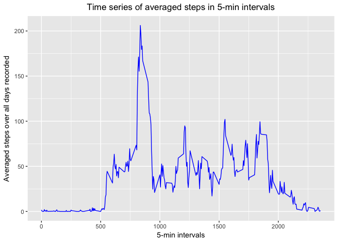

# Reproducible Research: Peer Assessment 1
This assignment makes use of data from a personal activity monitoring device. This device collects data at 5 minute intervals through out the day. The data consists of two months of data from an anonymous individual collected during the months of October and November, 2012 and include the number of steps taken in 5 minute intervals each day.

The variables included in this dataset are:

* steps: Number of steps taking in a 5-minute interval (missing values are coded as 𝙽𝙰)
* date: The date on which the measurement was taken in YYYY-MM-DD format
* interval: Identifier for the 5-minute interval in which measurement was taken

## Loading and preprocessing the data

Load libraries:


```r
library(data.table)
library(ggplot2)
```

Read the data into dt:


```r
setwd("/Users/zliu11/R_for_DScourses/Course5.ReproducibleRes/week2project/RepData_PeerAssessment1")
dt <- fread("activity.csv")
```

Transform date to Date type in dt:


```r
d <- dt$date
d <- as.POSIXct(d, format = "%Y-%m-%d")
dt$date <- d
```

## What is mean total number of steps taken per day?

Histogram of the total number of steps taken each day:


```r
totalStepsPerDay <- aggregate(steps ~ date, dt, sum)
f1 <- ggplot(data = totalStepsPerDay, aes(x=steps)) +
        geom_histogram(binwidth = 1000, color = "black", fill = "white") +
        labs(x="Total daily steps", y="Day counts", title = "Counts of the days for total daily steps") +
        scale_y_continuous(breaks = c(1:10)) +
        theme(plot.title = element_text(hjust = 0.5))
print(f1)
```

<!-- -->

Calculate and plot the mean and median numbers of steps taken each day


```r
tapply(dt$steps, dt$date, mean)
```

```
## 2012-10-01 2012-10-02 2012-10-03 2012-10-04 2012-10-05 2012-10-06 
##         NA  0.4375000 39.4166667 42.0694444 46.1597222 53.5416667 
## 2012-10-07 2012-10-08 2012-10-09 2012-10-10 2012-10-11 2012-10-12 
## 38.2465278         NA 44.4826389 34.3750000 35.7777778 60.3541667 
## 2012-10-13 2012-10-14 2012-10-15 2012-10-16 2012-10-17 2012-10-18 
## 43.1458333 52.4236111 35.2048611 52.3750000 46.7083333 34.9166667 
## 2012-10-19 2012-10-20 2012-10-21 2012-10-22 2012-10-23 2012-10-24 
## 41.0729167 36.0937500 30.6284722 46.7361111 30.9652778 29.0104167 
## 2012-10-25 2012-10-26 2012-10-27 2012-10-28 2012-10-29 2012-10-30 
##  8.6527778 23.5347222 35.1354167 39.7847222 17.4236111 34.0937500 
## 2012-10-31 2012-11-01 2012-11-02 2012-11-03 2012-11-04 2012-11-05 
## 53.5208333         NA 36.8055556 36.7048611         NA 36.2465278 
## 2012-11-06 2012-11-07 2012-11-08 2012-11-09 2012-11-10 2012-11-11 
## 28.9375000 44.7326389 11.1770833         NA         NA 43.7777778 
## 2012-11-12 2012-11-13 2012-11-14 2012-11-15 2012-11-16 2012-11-17 
## 37.3784722 25.4722222         NA  0.1423611 18.8923611 49.7881944 
## 2012-11-18 2012-11-19 2012-11-20 2012-11-21 2012-11-22 2012-11-23 
## 52.4652778 30.6979167 15.5277778 44.3993056 70.9270833 73.5902778 
## 2012-11-24 2012-11-25 2012-11-26 2012-11-27 2012-11-28 2012-11-29 
## 50.2708333 41.0902778 38.7569444 47.3819444 35.3576389 24.4687500 
## 2012-11-30 
##         NA
```

```r
tapply(dt$steps, dt$date, median)
```

```
## 2012-10-01 2012-10-02 2012-10-03 2012-10-04 2012-10-05 2012-10-06 
##         NA          0          0          0          0          0 
## 2012-10-07 2012-10-08 2012-10-09 2012-10-10 2012-10-11 2012-10-12 
##          0         NA          0          0          0          0 
## 2012-10-13 2012-10-14 2012-10-15 2012-10-16 2012-10-17 2012-10-18 
##          0          0          0          0          0          0 
## 2012-10-19 2012-10-20 2012-10-21 2012-10-22 2012-10-23 2012-10-24 
##          0          0          0          0          0          0 
## 2012-10-25 2012-10-26 2012-10-27 2012-10-28 2012-10-29 2012-10-30 
##          0          0          0          0          0          0 
## 2012-10-31 2012-11-01 2012-11-02 2012-11-03 2012-11-04 2012-11-05 
##          0         NA          0          0         NA          0 
## 2012-11-06 2012-11-07 2012-11-08 2012-11-09 2012-11-10 2012-11-11 
##          0          0          0         NA         NA          0 
## 2012-11-12 2012-11-13 2012-11-14 2012-11-15 2012-11-16 2012-11-17 
##          0          0         NA          0          0          0 
## 2012-11-18 2012-11-19 2012-11-20 2012-11-21 2012-11-22 2012-11-23 
##          0          0          0          0          0          0 
## 2012-11-24 2012-11-25 2012-11-26 2012-11-27 2012-11-28 2012-11-29 
##          0          0          0          0          0          0 
## 2012-11-30 
##         NA
```

```r
f2 <- ggplot(data = dt, aes(x=factor(date), y=steps)) +
        geom_boxplot(outlier.shape = NA, na.rm = TRUE) +
        labs(x="Date", y="Median and mean of the total steps", title = "Medians and means of the daily total steps") +
        stat_summary(fun.y=mean, geom="point", shape=23) +
        theme(axis.text.x = element_text(size = 6, angle = 90), plot.title = element_text(hjust = 0.5))
print(f2)
```

<!-- -->

Note that in the plot the mean values are presented by diamond signs.


## What is the average daily activity pattern?

Time series plot of the average number of steps taken on 5-min intervals averaged over all days


```r
mstep <- aggregate(steps ~ interval, dt, mean)
f3 <- ggplot(data = mstep, aes(x=interval, y=steps)) +
        geom_line(na.rm = TRUE, color = "blue") +
        labs(x="5-min intervals", y="Averaged steps over all days recorded", title = "Time series of averaged steps in 5-min intervals") +
        theme(plot.title = element_text(hjust = 0.5))
print(f3)
```

<!-- -->

Which 5-minute interval, on average across all the days in the dataset, contains the maximum number of steps?


```r
mstep[mstep$steps==max(mstep$steps),]$interval
```

```
## [1] 835
```


## Imputing missing values

Calculate and report the total number of missing values in the dataset (i.e. the total number of rows with NA)


```r
sum(is.na(dt))
```

```
## [1] 2304
```

Devise a strategy for filling in all of the missing values in the dataset.

Description of the imputing method: use the mean steps in 5-min intervals (averaged over all available days) and fill these numbers in the NAs corresponding to their respective intervals


```r
imdt <- dt
for (i in 1 : nrow(imdt)) {
        if (is.na(imdt[i, 1])) {
                imdt[i, 1] <- mstep[mstep$interval==imdt[[i, 3]],][2]
        }
}
```

Check to make sure no NAs in the dataset:


```r
sum(is.na(imdt))
```

```
## [1] 0
```

Histogram of the total number of steps taken each day for imputed dataset


```r
impStp <- aggregate(steps ~ date, imdt, sum)
f4 <- ggplot(data = impStp, aes(x=steps)) +
        geom_histogram(binwidth = 1000, color = "black", fill = "white") +
        labs(x="Total daily steps", y="Day counts", title = "Counts of the days for total daily steps (imputed dataset)") +
        scale_y_continuous(breaks = c(1:10)) +
        theme(plot.title = element_text(hjust = 0.5))
print(f4)
```

<!-- -->

Calculate and plot the mean and median numbers of steps taken each day (imputed dataset)


```r
tapply(imdt$steps, imdt$date, mean)
```

```
## 2012-10-01 2012-10-02 2012-10-03 2012-10-04 2012-10-05 2012-10-06 
## 36.9479167  0.4375000 39.4166667 42.0694444 46.1597222 53.5416667 
## 2012-10-07 2012-10-08 2012-10-09 2012-10-10 2012-10-11 2012-10-12 
## 38.2465278 36.9479167 44.4826389 34.3750000 35.7777778 60.3541667 
## 2012-10-13 2012-10-14 2012-10-15 2012-10-16 2012-10-17 2012-10-18 
## 43.1458333 52.4236111 35.2048611 52.3750000 46.7083333 34.9166667 
## 2012-10-19 2012-10-20 2012-10-21 2012-10-22 2012-10-23 2012-10-24 
## 41.0729167 36.0937500 30.6284722 46.7361111 30.9652778 29.0104167 
## 2012-10-25 2012-10-26 2012-10-27 2012-10-28 2012-10-29 2012-10-30 
##  8.6527778 23.5347222 35.1354167 39.7847222 17.4236111 34.0937500 
## 2012-10-31 2012-11-01 2012-11-02 2012-11-03 2012-11-04 2012-11-05 
## 53.5208333 36.9479167 36.8055556 36.7048611 36.9479167 36.2465278 
## 2012-11-06 2012-11-07 2012-11-08 2012-11-09 2012-11-10 2012-11-11 
## 28.9375000 44.7326389 11.1770833 36.9479167 36.9479167 43.7777778 
## 2012-11-12 2012-11-13 2012-11-14 2012-11-15 2012-11-16 2012-11-17 
## 37.3784722 25.4722222 36.9479167  0.1423611 18.8923611 49.7881944 
## 2012-11-18 2012-11-19 2012-11-20 2012-11-21 2012-11-22 2012-11-23 
## 52.4652778 30.6979167 15.5277778 44.3993056 70.9270833 73.5902778 
## 2012-11-24 2012-11-25 2012-11-26 2012-11-27 2012-11-28 2012-11-29 
## 50.2708333 41.0902778 38.7569444 47.3819444 35.3576389 24.4687500 
## 2012-11-30 
## 36.9479167
```

```r
tapply(imdt$steps, imdt$date, median)
```

```
## 2012-10-01 2012-10-02 2012-10-03 2012-10-04 2012-10-05 2012-10-06 
##       33.5        0.0        0.0        0.0        0.0        0.0 
## 2012-10-07 2012-10-08 2012-10-09 2012-10-10 2012-10-11 2012-10-12 
##        0.0       33.5        0.0        0.0        0.0        0.0 
## 2012-10-13 2012-10-14 2012-10-15 2012-10-16 2012-10-17 2012-10-18 
##        0.0        0.0        0.0        0.0        0.0        0.0 
## 2012-10-19 2012-10-20 2012-10-21 2012-10-22 2012-10-23 2012-10-24 
##        0.0        0.0        0.0        0.0        0.0        0.0 
## 2012-10-25 2012-10-26 2012-10-27 2012-10-28 2012-10-29 2012-10-30 
##        0.0        0.0        0.0        0.0        0.0        0.0 
## 2012-10-31 2012-11-01 2012-11-02 2012-11-03 2012-11-04 2012-11-05 
##        0.0       33.5        0.0        0.0       33.5        0.0 
## 2012-11-06 2012-11-07 2012-11-08 2012-11-09 2012-11-10 2012-11-11 
##        0.0        0.0        0.0       33.5       33.5        0.0 
## 2012-11-12 2012-11-13 2012-11-14 2012-11-15 2012-11-16 2012-11-17 
##        0.0        0.0       33.5        0.0        0.0        0.0 
## 2012-11-18 2012-11-19 2012-11-20 2012-11-21 2012-11-22 2012-11-23 
##        0.0        0.0        0.0        0.0        0.0        0.0 
## 2012-11-24 2012-11-25 2012-11-26 2012-11-27 2012-11-28 2012-11-29 
##        0.0        0.0        0.0        0.0        0.0        0.0 
## 2012-11-30 
##       33.5
```

```r
f5 <- ggplot(data = imdt, aes(x=factor(date), y=steps)) +
        geom_boxplot(outlier.shape = NA, na.rm = TRUE) +
        labs(x="Date", y="Median and mean of the total steps", title = "Medians and means of the daily total steps (imputed dataset)") +
        stat_summary(fun.y=mean, geom="point", shape=23) +
        theme(axis.text.x = element_text(size = 6, angle = 90), plot.title = element_text(hjust = 0.5))
print(f5)
```

<!-- -->

Note that in the plot the mean values are presented by diamond signs.


## Are there differences in activity patterns between weekdays and weekends?

Create a new factor variable in the dataset with two levels – “weekday” and “weekend” indicating whether a given date is a weekday or weekend day.


```r
wkvector <- weekdays(imdt[, date])
test <- wkvector %in% c("Saturday", "Sunday")
wkvector[test] = "Weekend"
wkvector[!test] = "Weekday"
imdt <- cbind(imdt, day.of.week = factor(wkvector))
```

Check to confirm the resulted dataset


```r
head(imdt)
```

```
##    steps       date interval day.of.week
## 1:     1 2012-10-01        0     Weekday
## 2:     0 2012-10-01        5     Weekday
## 3:     0 2012-10-01       10     Weekday
## 4:     0 2012-10-01       15     Weekday
## 5:     0 2012-10-01       20     Weekday
## 6:     2 2012-10-01       25     Weekday
```

Time series plot of the average number of steps taken on 5-min intervals averaged over all days


```r
imstep <- aggregate(steps ~ interval + day.of.week, imdt, mean)
f6 <- ggplot(data = imstep, aes(x=interval, y=steps)) +
        geom_line(color = "blue") +
        facet_grid(day.of.week ~ .) +
        labs(x="Interval", y="Number of steps")
print(f6)
```

<!-- -->

Therefore, it appears that the subject tends to be less active during weekends than weekdays in the morning but more active in the afternoon.
